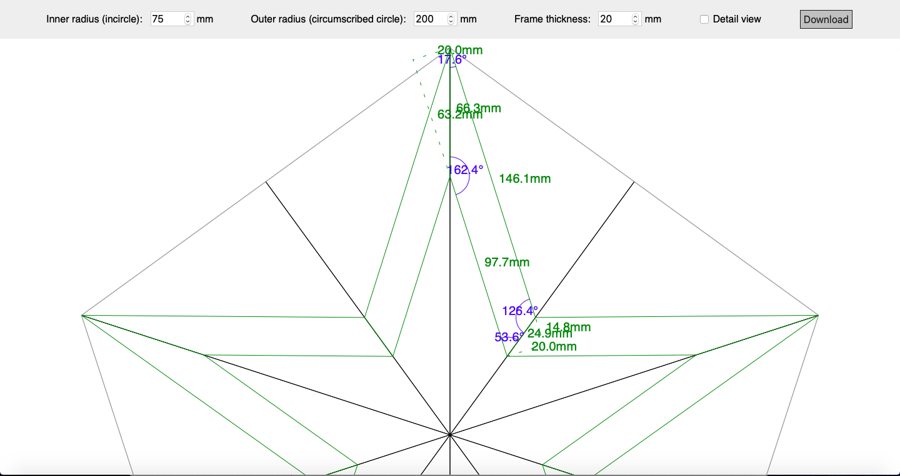
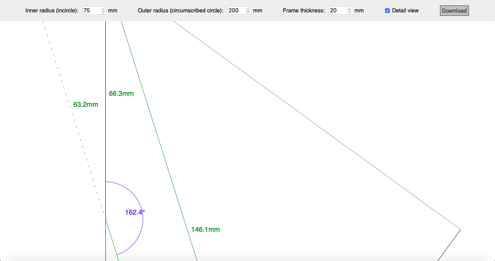

# Star Frame Visualizer #

Based on inner and outer radius of the star as well as the frame thickness the
website first calculates the dimensions and angles of the individual pieces
using Javascript. The overall star or a single section are then visualized on a
HTML5 canvas. In addition to the live view on the website the sketch can be
downloaded as 1:1 plan with a resolution of 300 DPI. That make it easy to print
templates for later cutting of the material.

### [Live demo](https://mpflanzer.github.io/Star-Frame-Visualizer/) ###

### Full view ###

### Detail view ###

